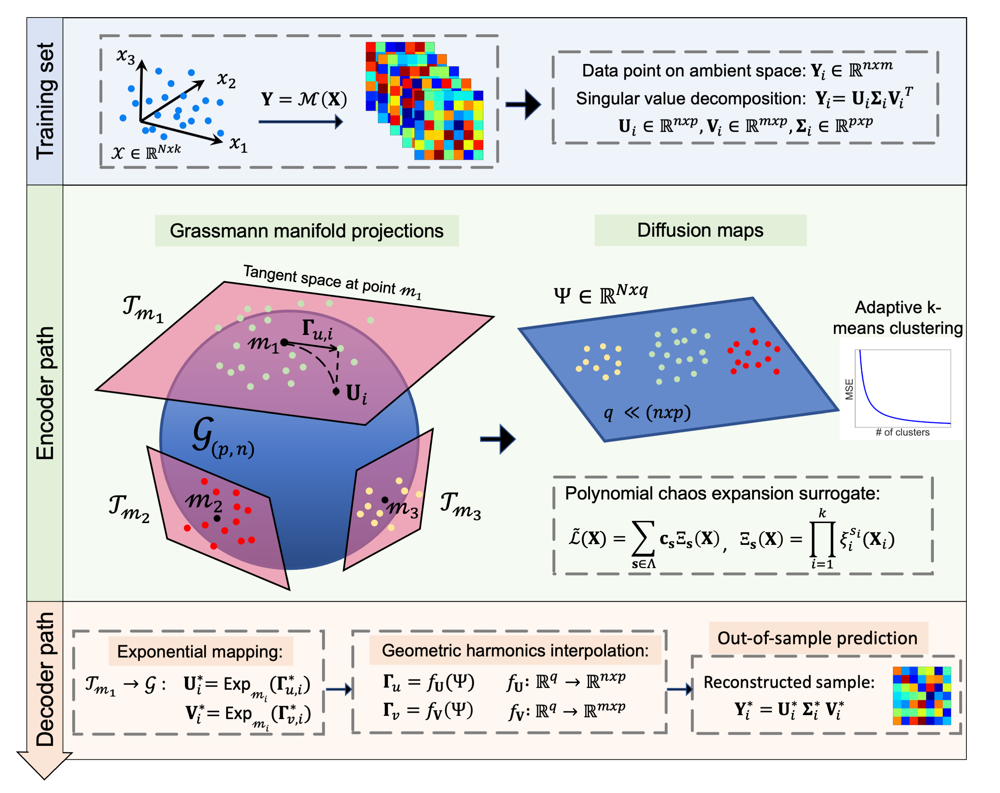
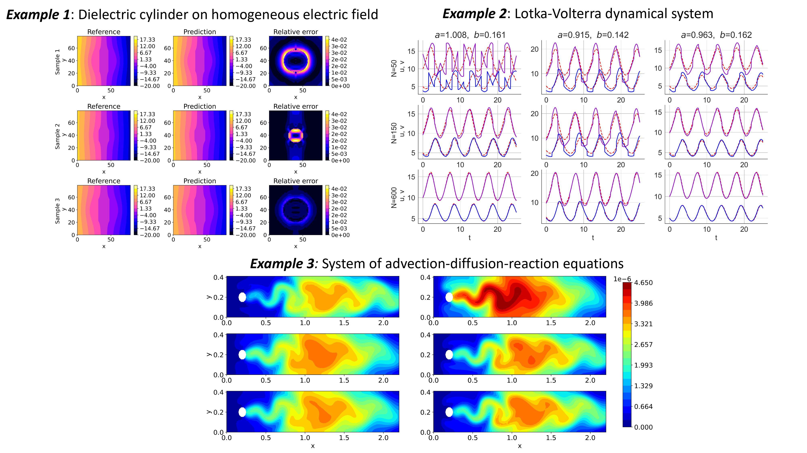

## Table of contents
* [General info](#general-info)
* [Methods-pipeline](#methods-pipeline)
* [Examples](#examples)
* [Contents](#contents)
* [Getting started](#getting-started)

## General info

This Git repository contains python codes for constructing Grassmannian diffusion maps-based adaptive polynomial chaos expansion surrogates, ideal for complex applications and models generating high-dimensional outputs. The proposed method called **GDM PCE**, is able to handle very high-dimensional datsets, perform succesfully in the small data regime and accelarate uncertainty quantification (UQ) tasks in general.

## Methods-pipeline

Details of the methdology can be found in our ArXiv paper here:  url

*Authors: Katiana Kontolati, Dimitrios Loukrezis, Ketson R. M. dos Santos, Dimitrios G. Giovanis, Michael D. Shields*

Below, a graphical summary of the method is provided:



## Application

Three illustrative examples are provided. The first considers a dielectric cylinder suspended in a homogeneous electric field. The second is the classic Lotka-Volterra dynamical system modeling the evolution of two species interacting with each other, one a predator and one a prey. Finally, the third example considers a system of advection-diffusion-reaction equations which models a first-order chemical reaction between two species. 
 

 
## Contents

* _data_ - Contains files with datasets and scripts required to run the examples.

* _GDM-PCE.py_ - python code to perform the proposed method

* _Example-1.py_ - Jupyter notebook for example 1

* _Example-2.py_ - Jupyter notebook for example 2
 
* _Example-3.py_ - Jupyter notebook for example 3

## Getting started
- Clone our repo: ```$ https://github.com/katiana22/GDM-PCE.git```
- Install dependencies via the ```requirements.txt``` file

### Mainteners
[Katiana Kontolati](https://twitter.com/kontolati)

:email: : kontolati@jhu.edu


